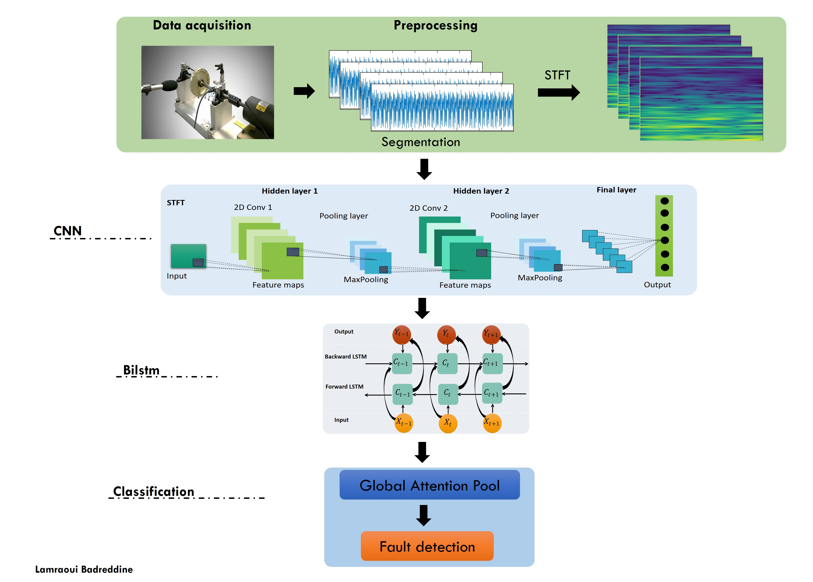
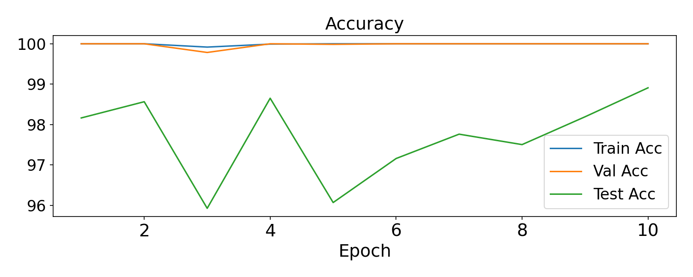
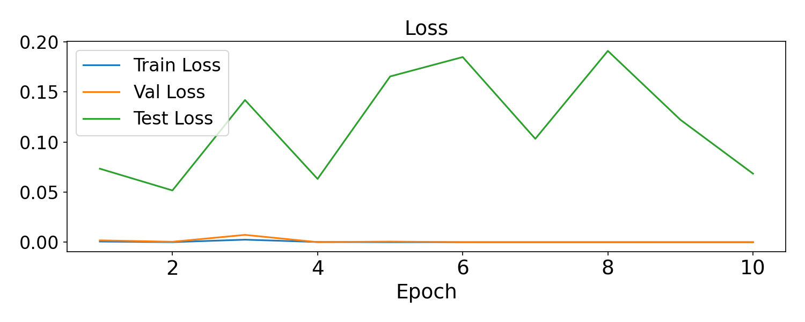
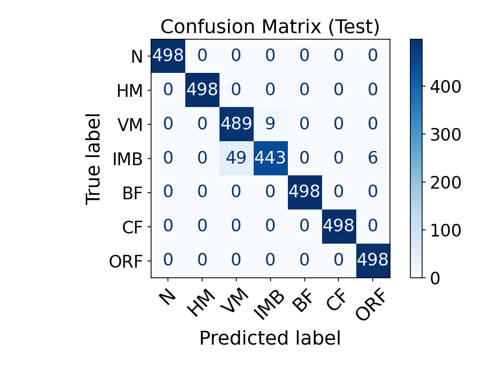
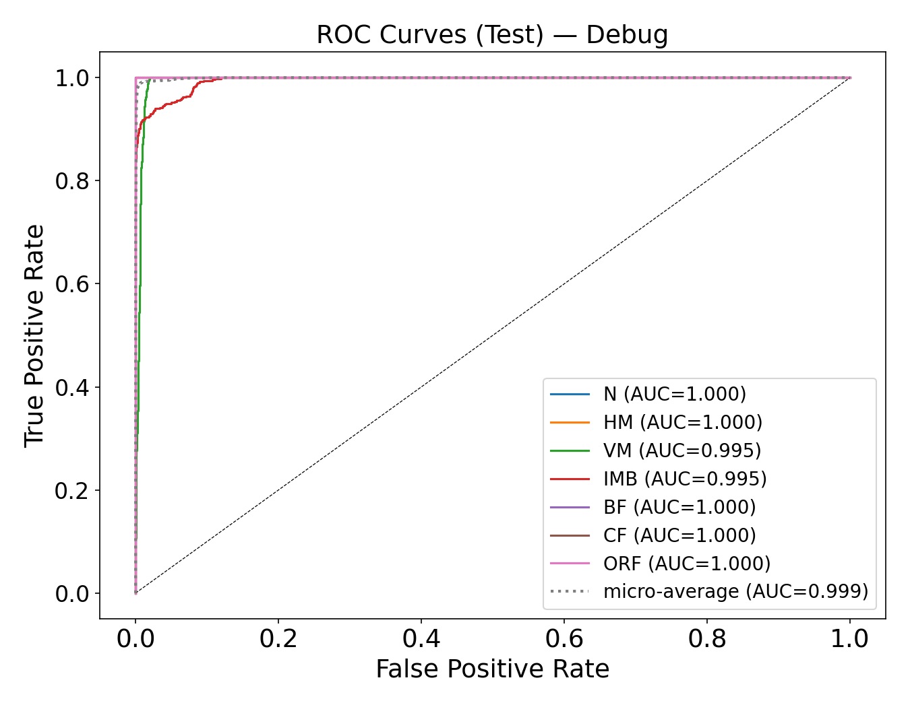
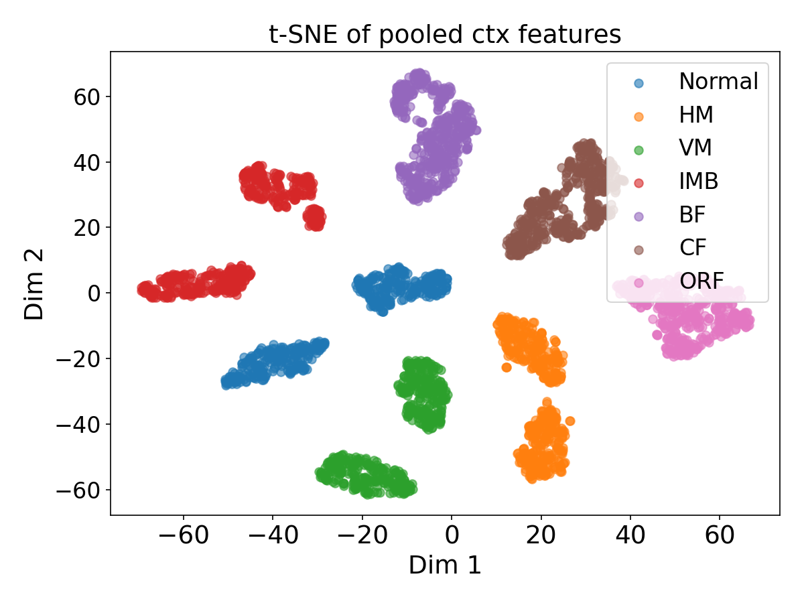

# Multi-Channel Spectrogram CNN-BiLSTM-Attention Deep Learning Framework for Advanced Rotating Machinery Fault Diagnosis

This repository delivers a state-of-the-art, end-to-end Deep Learning framework designed for automated, intelligent fault diagnosis in industrial rotating machinery. Moving beyond traditional manual feature engineering, this architecture treats multi-axial raw acceleration signals as non-stationary time-series, mapping them directly into the time-frequency domain via Short-Time Fourier Transform (STFT) spectrograms. 

Classification is handled by a robust hybrid topology combining a **2D Convolutional Neural Network (CNN) with Residual Shortcuts**, a **Bidirectional Long Short-Term Memory (BiLSTM)** recurrent network, and a **Global Attention Pooling Mechanism** to deliver definitive diagnostics across 7 distinct operational states.

---

## 🛠️ Architecture Topology & Deep Learning Pipeline

The framework utilizes an advanced sequence of deep layers optimized for cross-axial spatial coupling and non-stationary transient tracking:

### 1. Multi-Channel Signal Preprocessing 
* **Tri-Axial Data Processing:** The network simultaneously ingests three synchronized acceleration channels (representing Vertical, Horizontal, and Axial planes) to capture complete spatial vibration dynamics.

* **Standardization:** Segments undergo continuous z-score normalization ($X - \mu / \sigma$) per file to isolate physical transient phenomena from absolute signal power variations.

### 2. Time-Frequency Feature Extraction (Log-STFT)
* Raw segments are processed using the Short-Time Fourier Transform (STFT) with a Hann window ($\text{FFT Size} = 256$, $\text{Hop Length} = 64$) to build high-fidelity magnitude spectrograms.
* Spectrogram magnitudes are compressed via a log-scale transform ($\log(1 + x)$) to enhance the network's sensitivity to low-amplitude, high-frequency impact micro-shocks buried in background mechanical noise.

### 3. The CNN-BiLSTM-Attention Network Layout
* **2D Residual Convolution (`ConvResidualBlock2D`):** Ingests the multi-channel spectrogram matrix. It applies 2D convolutions paired with Batch Normalization, ReLU activations, Max Pooling, and a parallel $1\times1$ convolution identity shortcut layer to track complex spectral patterns without suffering from vanishing gradients.
* **Adaptive Frequency Avg Pooling:** Collapses the frequency bins into a unified feature dimension while fully preserving the temporal structure ($\text{Time Frames}$), prepping the sequential features for the recurrent layer.
* **Sequence Tracking via BiLSTM:** Processes the chronological feature sequence in both forward and backward directions, capturing the contextual dependency of repeating structural defects and cyclic impacts.
* **Global Attention Pooling:** A trained attention-scoring network evaluates each time step, automatically applying higher mathematical weights to critical transient fault impacts (such as localized bearing outer-race cracks) while ignoring baseline noise.
* **MLP Classifier:** A dense projection layer equipped with a $50\%$ Dropout regularizer translates the attention context vector into probabilities across the 7 targets.

---

## 📊 Multi-Class Fault Categories

The deep network is trained to classify the current structural state of the rotating machinery (Mafaulda dataset)into seven highly specific mechanical conditions:

1.  **Normal (N):** Baseline steady-state control condition.
2.  **Horizontal Misalignment (HM):** Geometric axis offset along the horizontal plane.
3.  **Vertical Misalignment (VM):** Geometric axis offset along the vertical plane.
4.  **Rotor Unbalance (IMB):** Mass eccentricity creating asynchronous rotational forces.
5.  **Bearing Fault (BF):** General rolling-element structural degradation.
6.  **Cocked Flush Fault (CF):** Complex misaligned/skewed bearing race mounting issue.
7.  **Outer-Race Fault (ORF):** Localized high-frequency impact defects on the stationary outer race ring.

---

## 📈 Evaluation & Optimization Visualizations

The script is hardcoded with strict reproducibility constraints (Deterministic Seeds) and outputs full diagnostic plots into the root folder upon completing a training sequence:

* `loss_history.png` & `acc_history.png` — High-resolution validation curves mapping convergence stability across training epochs.

* `confusion_matrix_test.png` — A clean, normalized test matrix utilizing standardized short labels (`N`, `HM`, `VM`, `IMB`, `BF`, `CF`, `ORF`) to track true positive rates.

* `roc_test_debug.png` — Multi-class Receiver Operating Characteristic curves displaying individual area-under-curve (AUC) performance along with Micro and Macro averages.

* `tsne_test_ctx.png` — 2D t-Distributed Stochastic Neighbor Embedding visualization verifying cluster separation of the deep attention context vectors (`ctx`).

---
